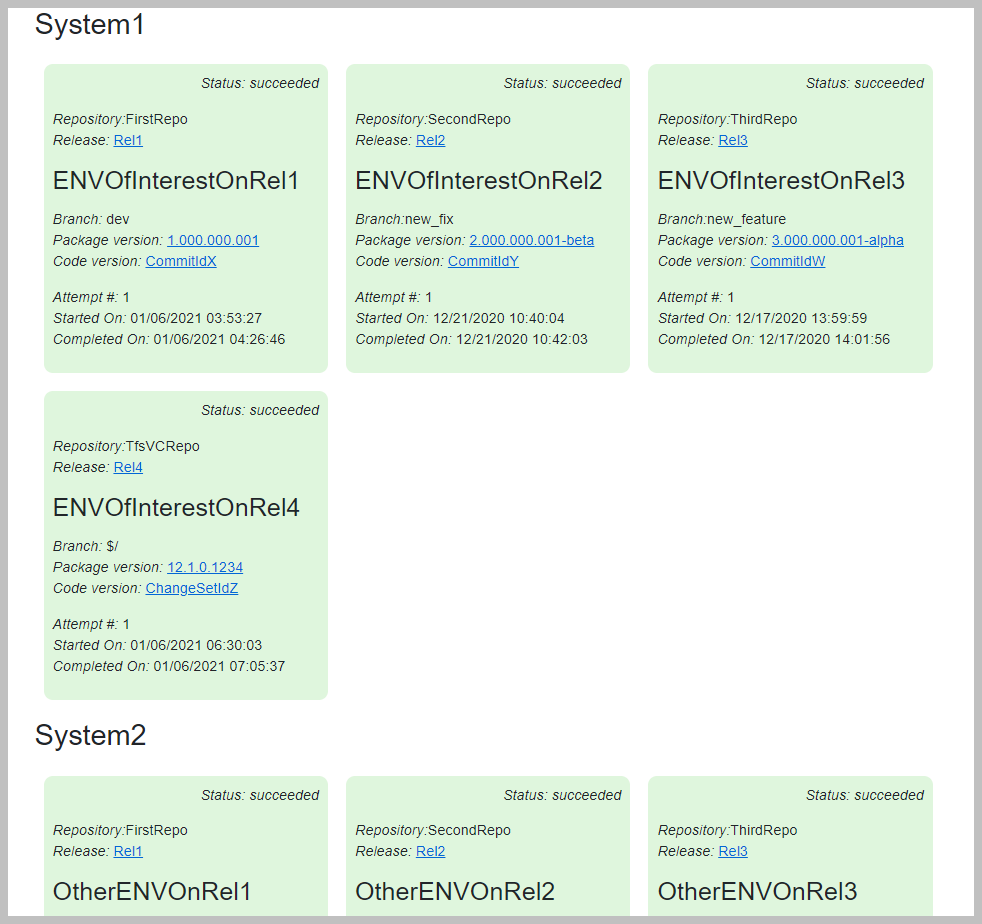

# TFS Deployment Checker

## Introduction

This tool is intended to provide a simplified visualization for the deployment of software under a microservice architecture.

As the number of applications to be deployed increases, the TFS UI tends to be difficult to use, as you'll end up having multiple builds, releases and team project.

The one aim of the *TFS Deployment Checker* tool is to provide a holistic view of the status of a given system.

## Definitions

* System: a collection of applications, deployed either onto machines or container orchestrators that translate into a usable version of your code
  Depending on your business model this might be:
  1 system for Dev, QA, Prod
  1 system per client
* Environment: one of the targets of any TFS Release
* [Default Collection](https://docs.microsoft.com/en-us/azure/devops/server/admin/manage-project-collections?view=azure-devops-2020): the TFS Default collection that is created on any new TFS instance 
* [Team Projects](https://docs.microsoft.com/en-us/aspnet/web-forms/overview/deployment/configuring-team-foundation-server-for-web-deployment/creating-a-team-project-in-tfs): the TFS logical unit that represent the work of a team (although it can be used as a different abstraction)
* [Team Projects](https://docs.microsoft.com/en-us/aspnet/web-forms/overview/deployment/configuring-team-foundation-server-for-web-deployment/creating-a-team-project-in-tfs): the TFS logical unit that represent the work of a team (although it can be used as a different abstraction)

## Sample output



## Configuration

* TfsUrl: the url of your tfs instance, including the default collection.
Example: https://myTfs.myDomain.com/tfs/myDefaultCollection
* TfsToken: the authentication token for accessing the tfs API.
The required scopes are:
    * Build: Read
    * Connected server
    * Release: Read
* AllowUntrustedSslCertificates: 
    * when launching the app as a docker container, if you're using a custom domain, the root CA will not be trusted by the container (as it won't be added). This is something that might be likely taken care of if the future. For the time being set it to *"true"* if your tfs endpoint uses https
    * when launching the app as an IIS/Kestrel app, the certs are taken from you machine, so you can probably let this set to *"false"*
* TeamProjectsAndReleaseIdsPairs:
a list of object that represent, for each TFS team project, the releases of interest.
The data is then stored in a structure defined as a List\<ReleasesForTeamProject>, where ReleasesForTeamProject is
```
public class ReleasesForTeamProject
{
    public string TfsTeamProjectName { get; set; }

    public IList<int> ProjectReleaseDefinitionIds { get; set; }
}
``` 

The format that must be specified in the appsettings.json file must escape the special character.

E.g. 
<pre>
*"[{\"TfsTeamProjectName\":\"TeamProject1\",\"ProjectReleaseDefinitionIds\":[50,51,52]},{\"TfsTeamProjectName\":\"TeamProject2\",\"ProjectReleaseDefinitionIds\":[1,2,3]}]"*
</pre>
Would mean that:

    * for the project with name TeamProject1 the release of interests are the one with ids 50,51,52
    * for the project with name TeamProject2 the release of interests are the one with ids 1,2,3

* SystemsOfInterest:
a comma separated list of the systems of interest. These names are then matched with the environment names present in the releases specified in the TeamProjectsAndReleaseIdsPairs setting. The matching rule is to look for the systems as substrings of the environment names in TFS.
E.g. if you specify: *"QA, DEV"* it would match environment names such as: 
    * For the QA system: *QAEnv*, *E01011120QAEnv*, *LPMNBGTQA*, etc
    * For the Sec system: *DevEnv*, *E01011120DevEnv*, *LPMNBGTDev*, etc

* HealthCheckIntervalInSeconds:
Specifies for how many second the health checks are cached (they can take 2-3 seconds and add strain to the TFS server, hence why caching can be a good idea).

* TfsApiVersion:
the version of the api to be called.
TFS supports multiple API versions. The supported values are starting from 4.0, provided they are existing TFS api versions (any preview on 4.0 is not supported).

## Technology

The app is built with blazor server (at the time of writing blazor web assembly was not dockerizable) and DotNet 5.0.

## HealthChecks

There are 2 endpoints for the healthchecks:
* /healthcheck: it returns a basic page with the 200 http code if all is good and the 500 http code if there is an error
* /healthcheckdetails:it returns a basic page with the 200 http code if all is good and a page with the 200 http code showing with the error details when there is an error.

Both endpoints use the HealthCheckIntervalInSeconds value.

## Additional info

Repo's sensitive information protected with 


Code quality assessed by [](https://codescene.io/projects/11772)

[](https://codescene.io/projects/11772)

[](https://codescene.io/projects/11772)
